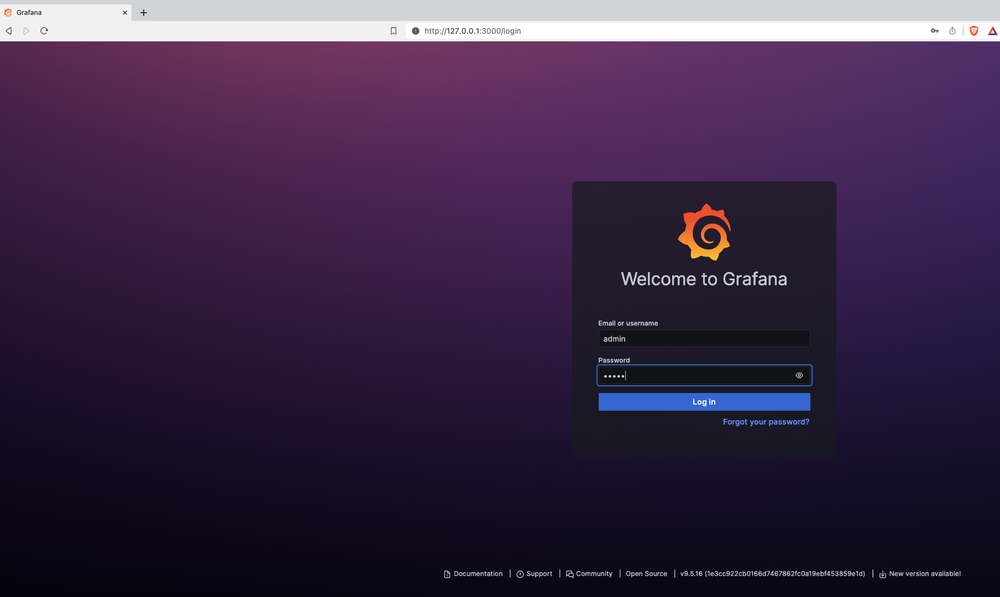
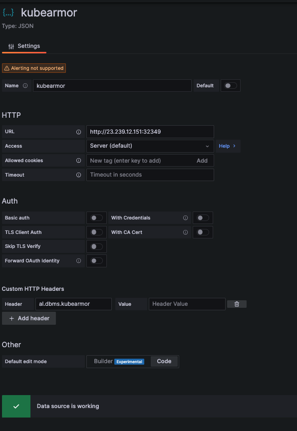
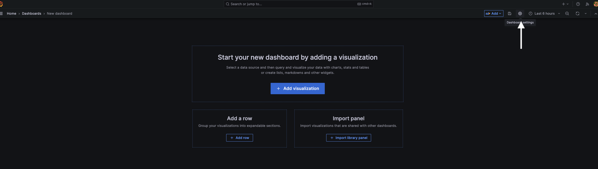
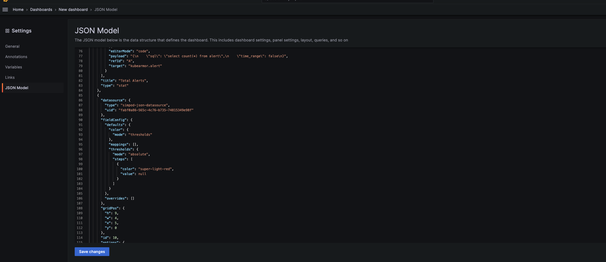
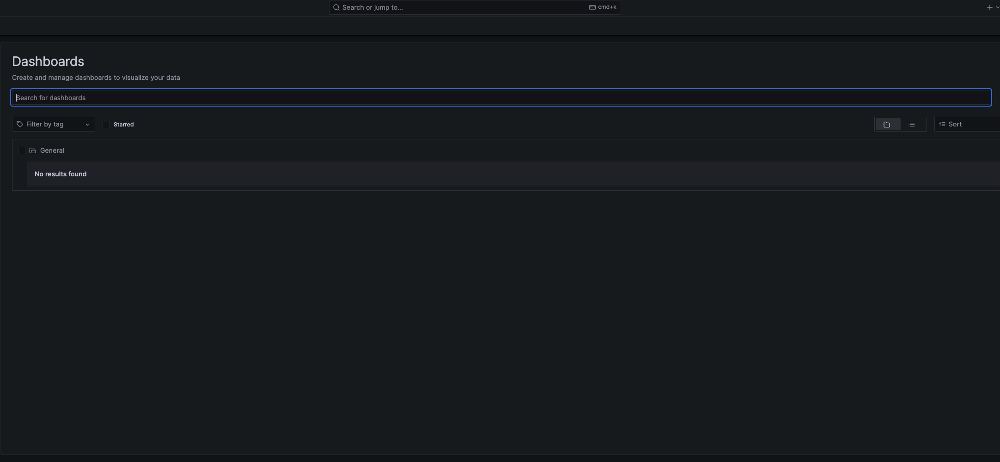
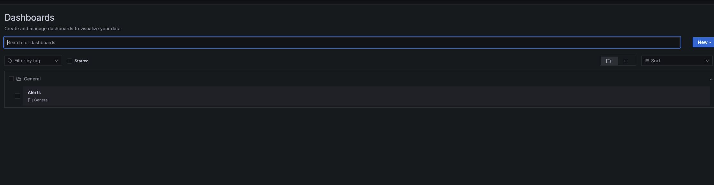
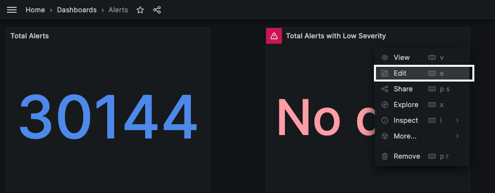

# Grafana

Grafana is an open-source BI tool managed by [Grafana Labs](https://grafana.com/). We utilize Grafana as our default 
demo BI tool. For details documentation of how to use Grafana, please visit our [official documentation](https://github.com/AnyLog-co/documentation/blob/master/northbound%20connectors/using%20grafana.md)

Using Grafana, users can visualize time series data using pre-defined queries and add new queries using SQL.

By default, this repository provides 3 base models for users to start with:
* [Network Map](network_summary.json) - The dashboard consists of a map showing the location of all the nodes in the 
network, as well as a list of tables and operators that are part of the network.


* [Kubernetes Alert](kubearmor_alert.json) - A dashboard demonstration (Alert) events seen by Kubearmor


* [Kubernetes Log](kubearmor_log.json) - A dashboard demonstrating (Log) events seen by Kubearmor


## Setting Up Grafana

* An [installation of Grafana](https://grafana.com/docs/grafana/latest/setup-grafana/installation/) - We support _Grafana_ version 7.5 and higher, we recommend using _Grafana_ version 9.5.16 or higher. 
```shell
docker run --name=grafana \
  -e GRAFANA_ADMIN_USER=admin \
  -e GRAFANA_ADMIN_PASSWORD=admin \
  -e GF_AUTH_DISABLE_LOGIN_FORM=false \
  -e GF_AUTH_ANONYMOUS_ENABLED=true \
  -e GF_SECURITY_ALLOW_EMBEDDING=true \
  -e GF_INSTALL_PLUGINS=simpod-json-datasource,grafana-worldmap-panel \
  -e GF_SERVER_HTTP_PORT=3000 \
  -v grafana-data:/var/lib/grafana \
  -v grafana-log:/var/log/grafana \
  -v grafana-config:/etc/grafana \
  -it -d -p 3000:3000 --rm grafana/grafana:9.5.16
```

* Log into Grafana and Declare a _(JSON) Data Source_
  1. [Login to Grafana](https://grafana.com/docs/grafana/latest/getting-started/getting-started/) - The default HTTP port that AnyLog GUI listens to is 3000 - On a local machine go to ```http://localhost:3000/```.



2. In _Data Sources_ section, create a new JSON data source
   * select a JSON data source.
   * On the name tab provide a unique name to the connection.
   * On the URL Tab add the REST address offered by the AnyLog node (i.e. http://10.0.0.25:2049)
   * On the ***Custom HTTP Headers***, name the default database. If no header is set, then all accessible databases to 
   the node will be available to query


| |  | 
| :---: | :---: |


## Uploading Dashboard

1. In a new Dashboard goto the _Settings_  



2. Go _JSON Model_ and add desired model

|  |  |
|:--------------------------------------------------------------------------------------------------:|:-------------------------------------------------------------------------------------:|

3. Save Changes 

4. Once the changes are saved, you should see a new Dashboard 

| Before |                                After                                |
| :---: |:-------------------------------------------------------------------:|
|  |  | 

5. For each of the widgets update the following information:



* Data Source 


* Metric value (AnyLog table name)


Once these changes are saved, the outcome should look something like this: 


